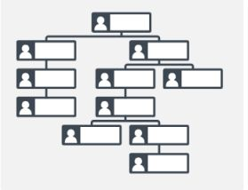
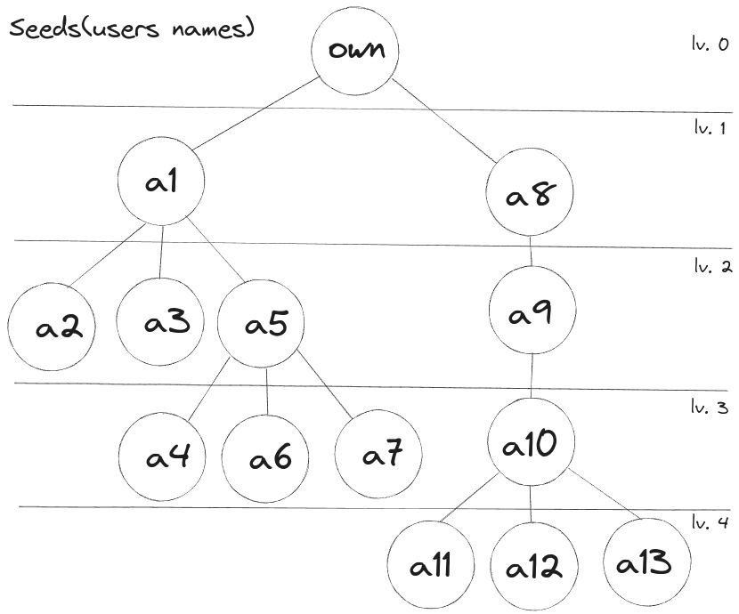

# Organizational Chart
This project aims on help managment of orgazational chart
<br>We can manage companies, users and leadership relations


<center></center>

## Project(board with cards)
[board from github's project](https://github.com/users/xitarps/projects/7/views/1)

## Critical decisions
Some decisions has been taken due the problem's scope:
 - A company existence requires a owner(seems not to be right to have a company withou a first user/owner)

 - Sidekiq was installed but since there are no great data handling right now it's not in use, please check:
 ```
 docker-compose exec web bash -c "rails notes ANNOTATION=TODO"
 ```
 - Some code structures could offend rubucop, with that in mind, some 'smelly' code was changed to fit it and some cops went disabled... applying i18n with yml should fix most of these problems
 - My target about the front end of this project was to use top notch techonolies such as HotWire, but with my shortage of time, i still couldn't apply it.
 Still react, vue etc could be integrated by adding minimal configs to docker-compose file, creating the app on the software folder and seeting up cors(rack-cors and it's configuration)
 
## ENVs
Please before start, pay attention to <b>'env.example'</b> , adjust as your needs
and rename it to: <b>'.env.development'</b>
<br>Then you will be are ready to work on it

## Api endpoints
In case of manual testing on insomnia, here a json with data all set:
 - Insomina file(json):
   - [Api Json file](./doc/insomnia/endpoints.json)

## Prerequisites
  - Docker
  - Docker compose

<br>for more details on how to install these tools:
[xita rps's gist](https://gist.github.com/xitarps/f20989a9976aab14517159fdc85a3223)

## Install/Configure

Clone the project:
```
git clone https://github.com/xitarps/organizational_chart
```
Enter the folder:
```
cd organizational_chart
```
Copy .env:
```
cp env.example .env.development
```
*obs: change it to meet your needs
Run container build:
```
docker-compose build
```
Start conainers:
```
docker-compse up
```
Prepare development enviroment(such as database migrations etc):
```
docker-compose exec web bash -c "bin/setup"
```
Optional - Run seeds to have data already set when starting the app
```
docker-compose exec web bash -c "rails db:seed"
```

## Run App
Start application:
```
docker-compose up
```
Then you can interact wit it with curl, insominia, postman etc

## Running tests
Run rspec:
```
docker-compose exec web bash -c "rspec"
```
*obs: test coverage can be found after running rspec on your browser on ./coverage/index.html
* if the page style seems weir is due permission issues, please run:
```
sudo chown -R ${USER}:${USER} ./coverage/
```

## Linter(rubocop)
Run rubcop:
```
docker-compose exec web bash -c "rubocop"
```

## Extra
[First sketch of the core concept/organizational chart](./doc/ruby/concept.rb)
to run it:
```
ruby ./doc/ruby/concept.rb
```
*obs: there's a binding to interact with it, to exit it, just type: <b>continue</b>

## Organizational chart's seeds visual abstraction
After running seeds, the organizational chart structure will be:

